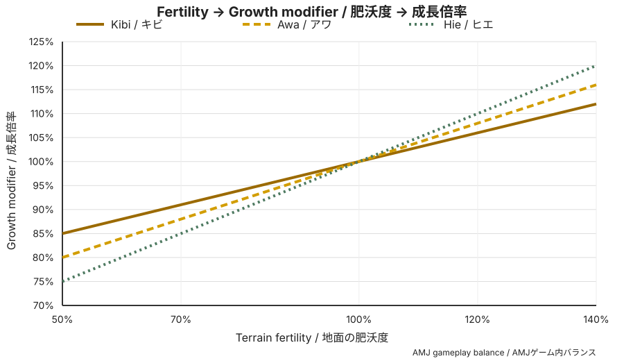
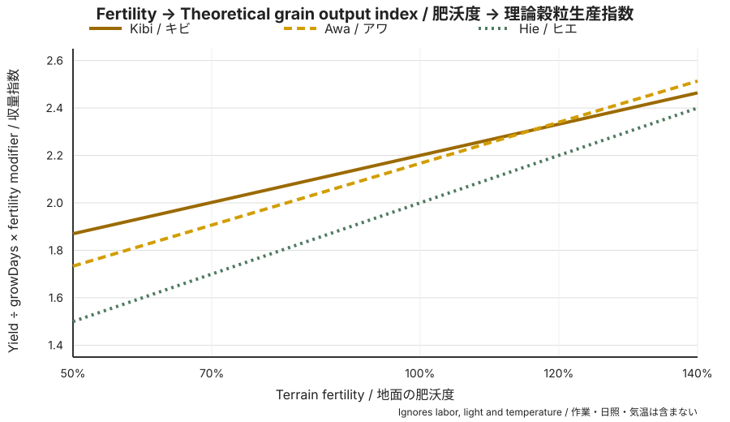
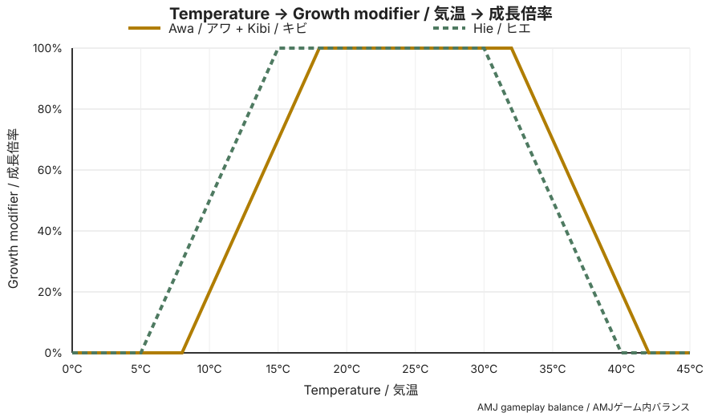

# Millet Cultivation Balance — アワ・ヒエ・キビ

> **このページの数値とグラフは現実の農業値ではない。**
> 現実の農学的特徴を参考に、RimWorld / AMJで作物選択が意味を持つよう変換した**ゲーム内バランス値**である。

この資料の目的は、設定値を列挙することではなく、プレイヤーが **「今の土地・気温・残り生育期間なら何を植えるか」** を判断できるようにすることである。

## 攻略上の結論

| 状況 | 有力候補 | 理由 |
|---|---|---|
| 残り生育期間が短い | **キビ** | `growDays 5` で3種最短 |
| 痩せ地を使いたい | **キビ** | `fertilitySensitivity 0.3` で肥沃度低下の影響が最小 |
| 普通～肥沃な主力畑 | **アワ** | 1回の収量が13と最大。キビより植え直し回数を抑えやすい |
| 春秋や寒冷地 | **ヒエ** | 5℃から成長域に入り、15℃で最適成長へ到達 |
| 暑い時期 | **アワ / キビ** | 最適域が32℃まで、成長可能域が42℃までありヒエより高温側に強い |

**重要:** RimWorldの `growDays` は暦日ではない。実際の収穫日は日照、温度、肥沃度などでさらに延びる。そのため、この資料では誤解を避けるため「実日数」へ固定換算せず、ゲーム内部の成長倍率と相対的な生産性で比較する。

## 採用バランス

| 作物 | growDays | 可食穀粒の基準収量 | fertilityMin | fertilitySensitivity | 成長可能温度 | 最適温度 |
|---|---:|---:|---:|---:|---:|---:|
| **Kibi / キビ** | **5** | 11 | 0.5 | **0.3** | 8～42℃ | 18～32℃ |
| **Awa / アワ** | 6 | **13** | 0.5 | 0.4 | 8～42℃ | 18～32℃ |
| **Hie / ヒエ** | 6 | 12 | 0.5 | 0.5 | **5～40℃** | **15～30℃** |

収穫後は3種とも共通の「雑穀束 → 殻付き雑穀 → 雑穀」へ統合する。料理・保存性能で3種を差別化せず、主な違いは**栽培時の土地・温度・時間**に置く。

## 肥沃度による違い

RimWorld 1.6の植物成長率では、肥沃度補正は次式で計算される。

`fertility × fertilitySensitivity + (1 - fertilitySensitivity)`

そのため、`fertilitySensitivity` が低い作物ほど痩せ地で減速しにくい。

| 肥沃度 | Kibi / キビ | Awa / アワ | Hie / ヒエ |
|---:|---:|---:|---:|
| 50% | **85%** | 80% | 75% |
| 70% | **91%** | 88% | 85% |
| 100% | 100% | 100% | 100% |
| 120% | 106% | 108% | **110%** |
| 140% | 112% | 116% | **120%** |

### 理論上の穀粒生産指数

下表は、温度・日照・作業時間を同条件と仮定し、

`基準収量 ÷ growDays × 肥沃度補正`

で比較した**理論上の相対指数**である。実ゲームでは播種・収穫作業、移動、温度、光量などが加わるため、絶対的な「日産量」ではない。

| 肥沃度 | Kibi / キビ | Awa / アワ | Hie / ヒエ |
|---:|---:|---:|---:|
| 50% | **1.87** | 1.73 | 1.50 |
| 70% | **2.00** | 1.91 | 1.70 |
| 100% | **2.20** | 2.17 | 2.00 |
| 120% | 2.33 | **2.34** | 2.20 |
| 140% | 2.46 | **2.51** | 2.40 |

攻略上は、**低～通常肥沃度ではキビの短期性が強く、非常に肥沃な畑ではアワの高い1回収量が追いつく**。さらにアワはキビより植え直し回数が少ないため、Pawnの農作業時間まで考えると、通常～肥沃な主力畑での価値は指数表より高くなり得る。

## 気温による違い

RimWorldの温度補正は、最低成長温度から最適最低温度まで線形に上昇し、最適温度帯では100%、最適最高温度から最大成長温度まで線形に低下する。

| 気温 | Kibi / キビ | Awa / アワ | Hie / ヒエ |
|---:|---:|---:|---:|
| 5℃ | 0% | 0% | 0% |
| 8℃ | 0% | 0% | **30%** |
| 10℃ | 20% | 20% | **50%** |
| 15℃ | 70% | 70% | **100%** |
| 18℃ | 100% | 100% | 100% |
| 30℃ | 100% | 100% | 100% |
| 32℃ | **100%** | **100%** | 80% |
| 35℃ | **70%** | **70%** | 50% |
| 40℃ | **20%** | **20%** | 0% |
| 42℃ | 0% | 0% | 0% |

攻略上の差は明確で、**ヒエは低温側の栽培期間を伸ばす作物、アワ・キビは高温側で長く性能を維持する作物**となる。18～30℃では3種とも温度補正100%なので、その範囲では生育日数・収量・肥沃度の違いが選択理由になる。

## 現実の特徴をどこまでゲーム化するか

### アワ

アワ（foxtail millet）は現実にも耐乾燥性と低窒素・低リン条件への適応が知られている。AMJでは「アワは痩せ地に弱い」とはせず、`fertilitySensitivity 0.4` として十分に低肥沃度へ対応させる。一方、キビとの差を作るため、**1回の収量を高くして標準畑の主力作物**というゲーム上の役割を与える。

### キビ

キビ（proso millet）は短い生育期間、乾燥適応、低投入・低肥沃度環境への適応が報告されている。AMJではこれを、**3種最短の growDays 5 と最小の fertilitySensitivity 0.3**として表現する。水分そのものを個別ステータスにはしていない。

### ヒエ

ヒエ（Japanese barnyard millet）は湿潤地・湛水栽培への適応が農研機構資料でも確認できる。ただしAMJでは、Marsh専用播種のような特殊処理は利用頻度に対して実装価値が低いと判断し、**現段階の攻略上の特徴には採用しない**。代わりに、頻繁に効く低温側の成長域を主要な個性とする。

### 病害・害獣

現実の病害・害虫・鳥害等による差は、現在のRimWorld農業で3種を自然に差別化できる仕組みがないため、AMJの作物バランスには使わない。

## 史実・農学的特徴とゲーム値の関係

ゲーム内の `growDays`、収量、肥沃度感応度、成長温度を、現実の「○日」「○℃」「○kg/ha」へ直接対応させない。品種・地域・栽培法による差が大きく、RimWorld自体も農作業時間を圧縮しているためである。

採用手順は次の通り。

1. 信頼性の高い資料から、作物間の**方向性**（早熟、低温側、低投入適応等）を確認する。
2. RimWorld / MOの既存作物との相対関係に変換する。
3. プレイヤーが土地・季節によって植え分ける理由が生まれるよう数値化する。
4. 1種類が常に最適にならないか、自動テストとプレイテストで再確認する。

## 主な参考資料

- 岩手県農業研究センター「キビ、アワの登熟特性からみた成熟期の推定」: キビは出穂後38～46日、アワは52～66日を成熟期推定の目安として報告。  
  https://www.pref.iwate.jp/agri/nouken/seika/bunya/hatasaku.html
- Nadeem et al. (2020), *Adaptation of Foxtail Millet (Setaria italica L.) to Abiotic Stresses*: アワの耐乾燥性、低窒素・低リン条件への適応をレビュー。  
  https://doi.org/10.3389/fpls.2020.00187
- Habiyaremye et al. (2017), *Proso Millet (Panicum miliaceum L.) and Its Potential for Cultivation in the Pacific Northwest, U.S.: A Review*: キビの60～100日の短い生育期間、乾燥・低肥沃度適応、水はけの悪い土への弱さをレビュー。  
  https://doi.org/10.3389/fpls.2016.01961
- 農研機構 中日本農業研究センター「ヒエ」: 湿潤地でも生育し、湛水栽培可能とする。  
  https://www.naro.go.jp/laboratory/carc/organic/ryokuhi-sakumotsu/hie.html
- RimWorld 1.6の植物成長式の確認には公開逆コンパイル資料を使用。バランス値の正本は本リポジトリの `Docs/Design.md` とPlantDef/Patchとする。  
  https://github.com/Chillu1/RimWorldDecompiled
